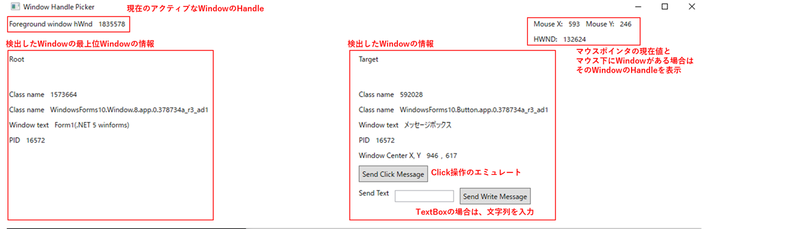

# WindowHandlePicker

Window handleによるWindow text(title)の検出、Click操作、テキストボックスのアップデート操作のテストが行える

## build

このディレクトリで

```bat
dotnet restore
dotnet clean
dotnet publish -r win-x64 -o .\WindowHandlePicker
```

## 操作

対象のWindowを右クリックすると、
そのWindowと最上位Windowの情報を読み取って表示する

- アプリ画面
